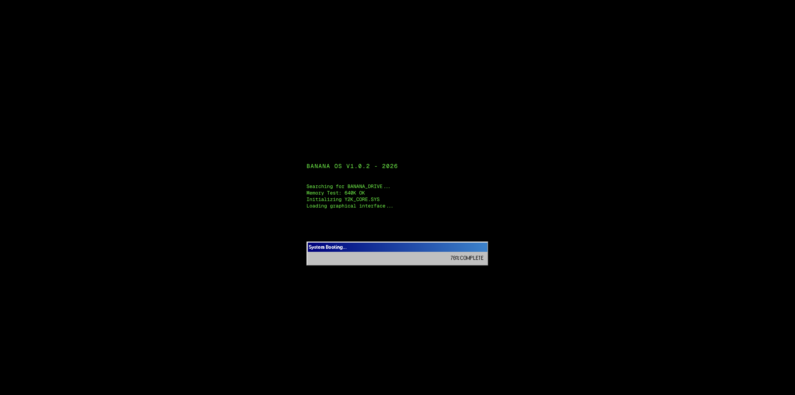
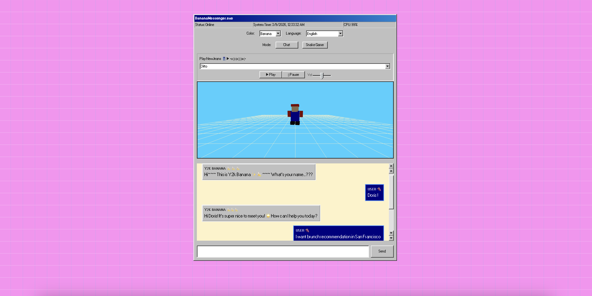
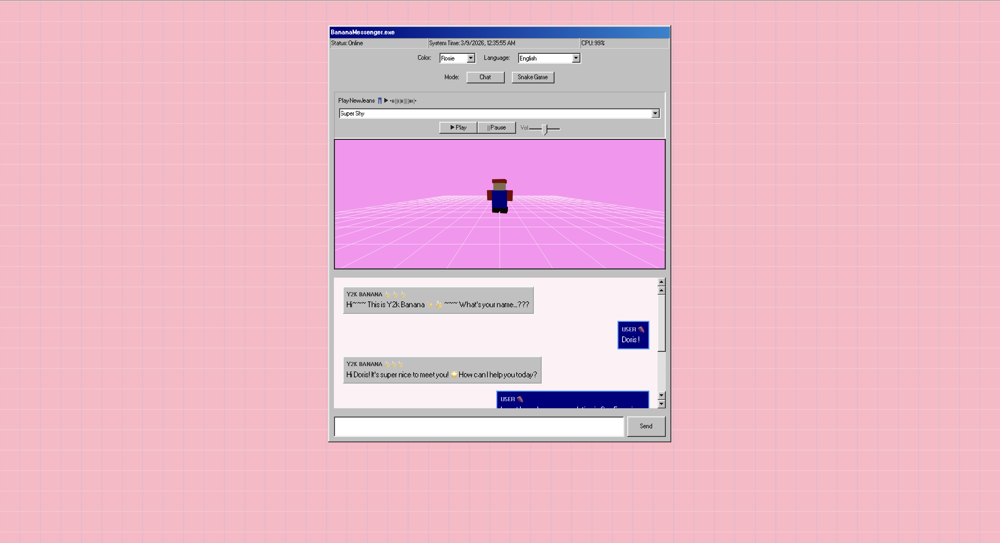
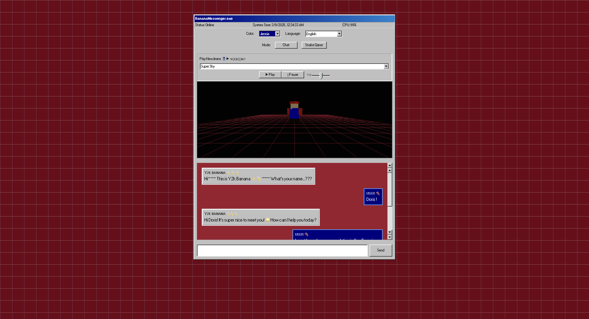
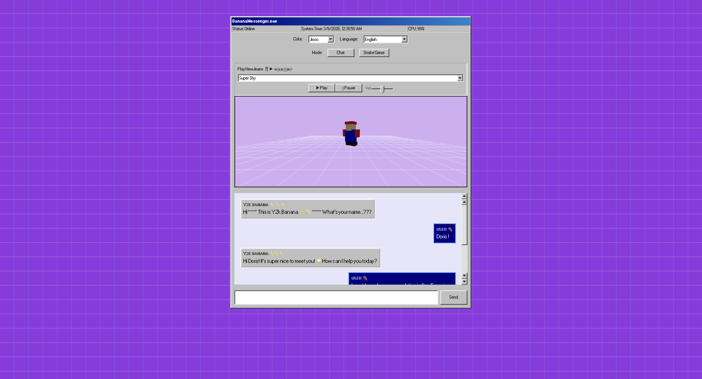
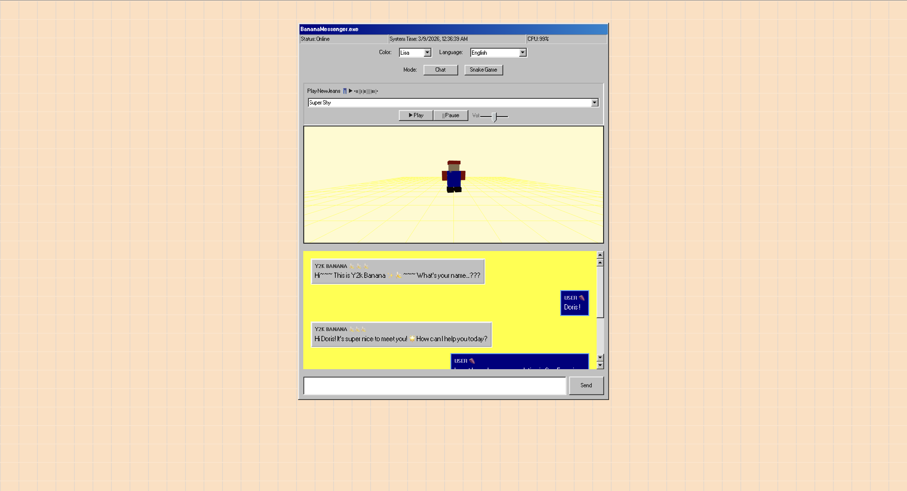
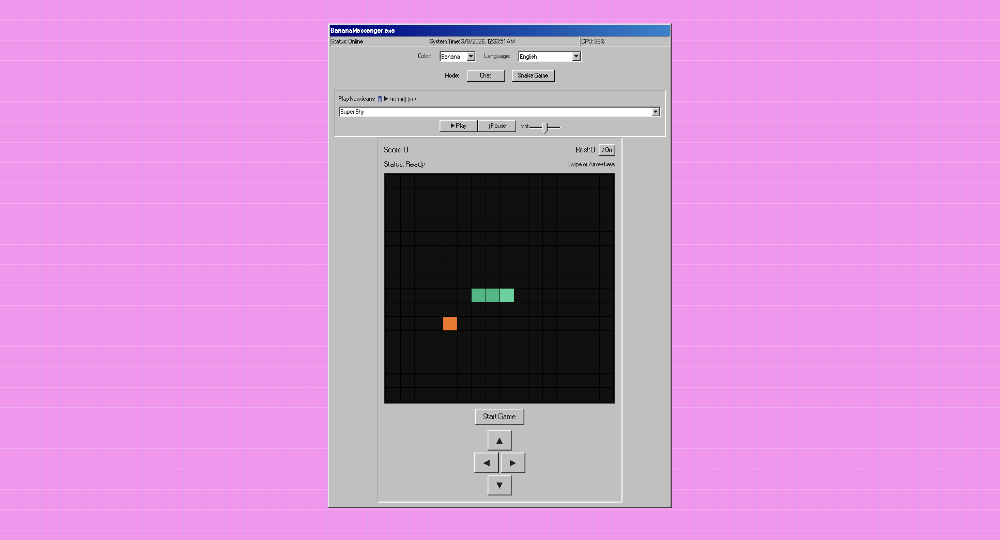

# Y2K Flying Bananas

A nostalgic Y2K-themed web app featuring an AI chatbot, a 3D spinning retro character, a built-in music player, and a classic Snake game — all wrapped in a Windows 98 UI.

## Demo : 🔗 [Y2K Flying Bananas](https://y2k-flying-bananas.vercel.app)

### Boot Screen



### Chat — Default (Banana) Theme



### Color Themes

|              Rosie              |              Jennie               |
| :-----------------------------: | :-------------------------------: |
|  |  |
|            **Jisoo**            |             **Lisa**              |
|  |      |

### Snake Game



## Features

- **BananaMessenger.exe** : Chat with "Y2K Banana," an AI-powered chatbot (OpenAI GPT-3.5) that replies in your chosen language
- **3D Viewport** : A spinning low-poly retro hero rendered with React Three Fiber, inspired by N64 character select screens
- **Retro Boot Screen** : A fake DOS-style loading sequence before the app launches
- **Snake Game** : A fully playable Snake mode with 8-bit sound effects, a background melody, swipe support, and local high-score tracking
- **Music Player** : A built-in NewJeans playlist with play/pause and volume controls
- **Color Themes** : Five switchable color palettes (Banana, Rosie, Jennie, Jisoo, Lisa)
- **Multi-Language** : Chat responses in English, Traditional Chinese, Japanese, Spanish, or Korean

## Tech Stack

| Layer     | Technology                                                                                                                                             |
| --------- | ------------------------------------------------------------------------------------------------------------------------------------------------------ |
| Framework | [Next.js](https://nextjs.org) 16 (App Router)                                                                                                          |
| UI        | React 19, [98.css](https://jdan.github.io/98.css/), [Tailwind CSS](https://tailwindcss.com) 4                                                          |
| 3D        | [Three.js](https://threejs.org) via [@react-three/fiber](https://docs.pmnd.rs/react-three-fiber) & [@react-three/drei](https://github.com/pmndrs/drei) |
| AI        | [OpenAI](https://platform.openai.com) API (GPT-3.5 Turbo)                                                                                              |
| Icons     | [Lucide React](https://lucide.dev)                                                                                                                     |

## Getting Started

### Prerequisites

- Node.js 18+
- An [OpenAI API key](https://platform.openai.com/account/api-keys)

### Setup

1. Clone the repo and install dependencies:

```bash
git clone https://github.com/Yingyingcheng/y2k-flying-bananas
cd y2k-flying-bananas
npm install
```

2. Create a `.env.local` file in the project root with your OpenAI key:

```
OPENAI_API_KEY=sk-...
```

3. Start the development server:

```bash
npm run dev
```

4. Open [http://localhost:3000](http://localhost:3000) in your browser.

## Project Structure

```
src/
├── app/
│   ├── api/chat/route.ts   # OpenAI chat API route
│   ├── layout.tsx           # Root layout
│   └── page.tsx             # Main page (chat, theme, music, mode switching)
├── components/
│   ├── BananaScene.tsx      # 3D scene with retro hero & grid floor
│   ├── LoadingScreen.tsx    # DOS-style boot animation
│   └── SnakeGame.tsx        # Snake game with touch & keyboard controls
public/
└── music/                   # NewJeans MP3 tracks
```

## Scripts

| Command         | Description            |
| --------------- | ---------------------- |
| `npm run dev`   | Start dev server       |
| `npm run build` | Production build       |
| `npm start`     | Serve production build |
| `npm run lint`  | Run ESLint             |

## License

This project's source code is licensed under the [MIT License](LICENSE).

**Note:** The music files in `public/music/` are copyrighted by their respective artists and are not covered by this license.
